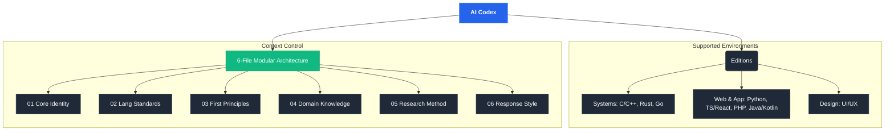

# AI Codex

<div align="center">

**Transform any AI assistant into a senior-level engineering partner.**

[](LICENSE)
[](#available-editions)
[](#contributing)

*Not a tutor. Not a code generator. A thinking partner for people who build things that do not exist yet.*

</div>

---

## What Is This?

**AI Codex** is a modular collection of AI system prompt instructions — engineered to transform any AI assistant into a domain-expert engineering partner. Each edition is split into 6 focused files that can be loaded selectively, keeping AI context sharp and precise.




---

## How It Works

```
 YOU                        AI CODEX                        AI ASSISTANT
 ───                        ────────                        ────────────

  "I need to build       ┌─────────────────┐
   a lock-free queue     │ Select Edition  │
   in Rust"              │ (Rust)          │
        │                └────────┬────────┘
        │                         │
        │                ┌────────┴────────┐
        │                │ Choose Files:   │
        │                │ 01 + 02 + 04    │
        │                └────────┬────────┘
        │                         │
        ▼                         ▼
  ┌──────────┐           ┌──────────────────┐          ┌──────────────────┐
  │  Your    │  ──────►  │  Load into your  │  ──────► │  AI now thinks   │
  │  Idea    │           │  AI platform     │          │  like a Senior   │
  └──────────┘           └──────────────────┘          │  Rust Systems    │
                                                       │  Engineer        │
                                                       └──────────────────┘
```

1. **Pick your edition** — choose the language/domain that matches your project
2. **Select your files** — load only what you need for the current session
3. **Paste into your AI tool** — works with any platform (see integrations below)
4. **Start building** — your AI is now a domain-expert engineering partner

---

## Available Editions

A single index of all modular prompt editions. Click on an edition to view its detailed documentation, configuration, and capabilities.

| Edition | Primary Focus | Target Stack & Tools | Folder / Docs |
| :--- | :--- | :--- | :--- |
| **🔧 C / C++** | Research, low-level systems, new technology invention | Systems, GPU, AI runtimes, compiler design | [`c-cpp/`](c-cpp/SKILL.md) |
| **🐍 Python** | Production systems, AI/ML engineering, data science | PyTorch, FastAPI, Pandas, Hugging Face, uv | [`python/`](python/SKILL.md) |
| **⚡ TypeScript / React** | Modern frontend architecture & fullstack applications | React 19, Next.js 15, strict TS, Web ecosystem | [`typescript-react/`](typescript-react/SKILL.md) |
| **🐘 PHP** | Web apps, backend architecture, modern API design | PHP 8.3+, Laravel, Symfony, PSRs, security | [`php/`](php/SKILL.md) |
| **🦀 Rust** | Safe systems programming, concurrency, embedded, WASM | Tokio async, Cargo, Clippy, unsafe discipline | [`rust/`](rust/SKILL.md) |
| **🔷 Go** | Cloud-native microservices, DevOps, CLI tools | Kubernetes, Docker, observability, database drivers | [`go/`](go/SKILL.md) |
| **☕ Java / Kotlin** | Enterprise backend services, Android apps, microservices | JVM 21, Spring Boot, Compose, Kafka, Kotlin 2.0 | [`java-kotlin/`](java-kotlin/SKILL.md) |
| **🎨 UI/UX Design** | Product design, design systems, accessibility | Figma, tokens, visual hierarchy, user research | [`ui-ux-design/`](ui-ux-design/SKILL.md) |

---

## Recommended Combinations

Pick files based on what you are doing — you do not always need all six.

| What you are doing | Files to load | Why |
|--------------------|---------------|-----|
| 🔍 Exploring a new idea | 01 + 03 + 05 | Identity + reasoning + research method |
| ✍️ Writing production code | 01 + 02 + 06 | Identity + standards + output format |
| 📚 Deep technical research | 01 + 03 + 04 | Identity + reasoning + domain expertise |
| 🏗️ Full invention session | All six | Maximum context for complex work |

---

## Editor & Platform Integrations

### Cursor

Place instruction files in your project root and reference them in `.cursorrules`:

```
# .cursorrules
Read and follow the instructions in these files:
- python/01-core-identity.md
- python/02-languages-standards.md
- python/06-response-style.md
```

### Claude Code

Add to your project's `CLAUDE.md` file or use the `--system-prompt` flag:

```bash
# Option 1: CLAUDE.md (recommended — auto-loaded per project)
# Create a CLAUDE.md at your project root:
cat python/01-core-identity.md python/02-languages-standards.md > CLAUDE.md

# Option 2: Direct system prompt
claude --system-prompt "$(cat python/01-core-identity.md)"
```

### Kilo Code / Roo Code

Add as custom instructions in the extension settings:

1. Open the Kilo Code / Roo Code sidebar
2. Go to **Settings** → **Custom Instructions**
3. Paste the contents of `01-core-identity.md` into the system prompt field
4. Add additional file contents as needed for your session

### Windsurf

Add to your project's Windsurf rules file:

```
# .windsurfrules
Read and follow the instructions in these files:
- rust/01-core-identity.md
- rust/02-languages-standards.md
- rust/04-domains-knowledge.md
```

### GitHub Copilot

Configure via `.github/copilot-instructions.md` in your repository:

```markdown
<!-- .github/copilot-instructions.md -->
<!-- Paste the contents of your chosen instruction files here -->
<!-- Copilot will use these as context for all suggestions in this repo -->
```

Or use Copilot Chat's custom instructions in VS Code:
1. Open VS Code Settings → search "Copilot Instructions"
2. Point to your instruction files or paste contents directly

### Cline (VS Code Extension)

Add as custom instructions in the Cline settings:

1. Open the Cline sidebar panel
2. Click the **Settings** gear icon
3. Under **Custom Instructions**, paste the contents of your chosen files
4. Cline will use these instructions for all interactions in the workspace

### Continue (VS Code / JetBrains)

Configure in `.continue/config.json`:

```json
{
  "systemMessage": "Follow the instructions defined in the AI Codex files.",
  "docs": [
    { "title": "Core Identity", "startUrl": "python/01-core-identity.md" },
    { "title": "Standards", "startUrl": "python/02-languages-standards.md" }
  ]
}
```

### Aider

Pass instruction files as read-only context:

```bash
# Load AI Codex files as context for your session
aider --read python/01-core-identity.md \
      --read python/02-languages-standards.md \
      --read python/06-response-style.md \
      your_code.py
```

### Zed

Add to your project's `.zed/settings.json`:

```json
{
  "assistant": {
    "default_model": {
      "custom_instructions": "Follow the AI Codex instructions from the c-cpp/ directory in this project."
    }
  }
}
```

### Amazon Q Developer

Paste instruction contents into the system prompt via:
1. Open Amazon Q panel in your IDE
2. Navigate to **Customization** → **System Prompt**
3. Paste the contents of the relevant instruction files

### JetBrains AI Assistant

Configure in JetBrains IDE settings:
1. **Settings** → **Tools** → **AI Assistant** → **Custom Prompts**
2. Create a new custom prompt with the instruction file contents
3. Set it as the default system prompt for your project

### Augment Code

Add to your workspace configuration:
1. Open Augment settings in VS Code
2. Under **Instructions**, add the contents of your chosen files
3. Instructions persist across sessions for the workspace

### Gemini Code Assist / Antigravity AI

1. Open your Agent or Space settings
2. Paste `01-core-identity.md` as the base instruction (always)
3. Add the specific file(s) relevant to your current session
4. Start building

### ChatGPT / Claude (Web)

Paste the contents of the files you need at the start of a new conversation. For ChatGPT, you can also add them to **Custom Instructions** or a **GPT** configuration.

### Any Other AI Tool

The instruction files are plain Markdown. They work with any AI assistant that accepts a system prompt or custom instructions:

1. Open the system prompt / custom instruction setting
2. Paste the contents of `01-core-identity.md` (always include this)
3. Add additional files relevant to your task
4. Start your session

---

## Project Structure

```
ai-codex/
│
├── c-cpp/                          # C/C++ — Research & Invention Edition
│   ├── SKILL.md                    # Edition metadata and quick reference
│   ├── 01-core-identity.md
│   ├── 02-languages-standards.md
│   ├── 03-first-principles.md
│   ├── 04-domains-knowledge.md
│   ├── 05-research-method.md
│   └── 06-response-style.md
│
├── python/                         # Python — AI/ML & Systems Edition
│   ├── SKILL.md
│   └── 01 … 06
│
├── typescript-react/               # TypeScript / React / Next.js Edition
│   ├── SKILL.md
│   └── 01 … 06
│
├── php/                            # PHP — Modern Web & API Engineering
│   ├── SKILL.md
│   └── 01 … 06
│
├── rust/                           # Rust — Systems & Safety Edition
│   ├── SKILL.md
│   └── 01 … 06
│
├── go/                             # Go — Cloud Infrastructure & DevOps
│   ├── SKILL.md
│   └── 01 … 06
│
├── java-kotlin/                    # Java / Kotlin — Enterprise & Android
│   ├── SKILL.md
│   └── 01 … 06
│
├── ui-ux-design/                   # UI/UX Design — Interface & Systems
│   ├── SKILL.md
│   └── 01 … 06
│
├── integrations/                   # Pre-built editor config templates
│   ├── README.md                   # Integration guide
│   ├── cursorrules.example         # Cursor
│   ├── CLAUDE.example.md           # Claude Code
│   ├── windsurfrules.example       # Windsurf
│   ├── copilot-instructions.example.md  # GitHub Copilot
│   ├── continue-config.example.json     # Continue
│   └── zed-settings.example.json        # Zed
│
├── codex.json                      # Structured manifest for all editions
├── LICENSE                         # MIT License
└── README.md                       # You are here
```

---

## The 6-File Architecture

Every edition follows the same structure. This is intentional — it means once you learn one edition, you know them all.

```
┌──────────────────────────────────────────────────────────────────────┐
│                                                                      │
│  01 CORE IDENTITY        Who the AI is. Always load this.            │
│  ──────────────────                                                  │
│        │                                                             │
│        ├── 02 LANGUAGE STANDARDS     Code rules, version targets     │
│        │                                                             │
│        ├── 03 FIRST PRINCIPLES       How to reason and invent        │
│        │                                                             │
│        ├── 04 DOMAIN KNOWLEDGE       Deep expertise by field         │
│        │                                                             │
│        ├── 05 RESEARCH METHOD        Hypothesis → experiment → learn │
│        │                                                             │
│        └── 06 RESPONSE STYLE         Output format, tone, refs       │
│                                                                      │
└──────────────────────────────────────────────────────────────────────┘

      Always load 01. Add others based on what you are doing.
```

---

## Roadmap

Upcoming editions planned for future releases:

- [ ] Swift — iOS & macOS Development Edition
- [ ] C# / .NET — Enterprise & Game Development Edition

---

## Philosophy

The best AI instructions do not make AI smarter — they make AI *think the right way* for the task at hand. These instructions are built on one belief:

> The most valuable thing AI can do is not answer questions. It is help you ask better ones.

### Why Modular?

Most AI instruction projects dump everything into one massive file. This wastes context and dilutes focus. AI Codex splits instructions into focused files because:

- **Context is finite** — load only what you need, keep the AI sharp
- **Sessions vary** — a code review session needs different context than an invention session
- **Quality over quantity** — six precise files outperform one unfocused megafile

### Why Opinionated?

Each edition makes clear engineering recommendations. Not "here are your options" — but "here is what we recommend and why." Because:

- Vague instructions produce vague output
- Opinionated prompts produce opinionated, actionable engineering guidance
- An AI that says "it depends" on everything is useless as a partner

---

## Contributing

Contributions are welcome. If you want to add a new edition, improve an existing one, or add integrations:

1. **Fork** the repository
2. **Create a branch** for your changes
3. **Follow the 6-file structure** — every edition uses the same architecture
4. **Match the tone** — direct, opinionated, no filler, peer-level
5. **Submit a PR** with a clear description of what you changed and why

### Ideas for New Editions

- Swift — iOS & macOS Development
- C# / .NET — Enterprise & Game Development (Unity)

---

## License

This project is licensed under the **MIT License** — see the [LICENSE](LICENSE) file for details.

You are free to use, modify, and distribute these instructions for any purpose. Attribution is appreciated but not required.

---

<div align="center">

*Built with intent. Shared with the world.*

**[⭐ Star this repo](../../stargazers)** if it makes your AI sessions better.

</div>
