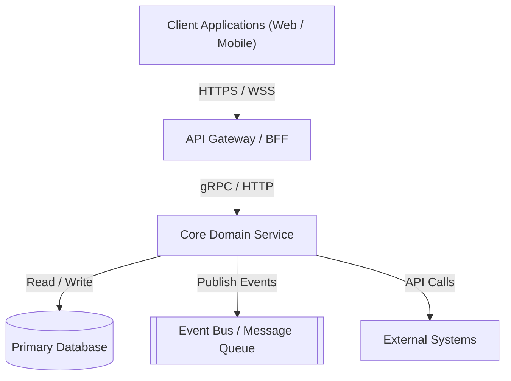
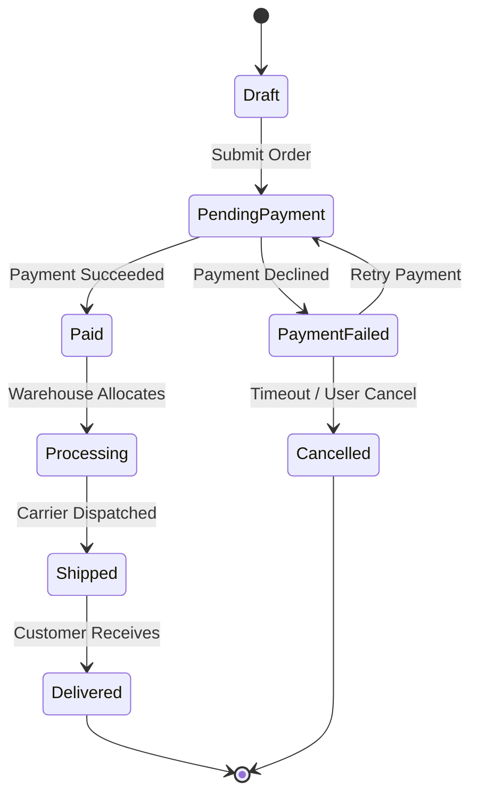

# Codex Architecture — System & Domain Modeling Skill

> The architectural design engine of AI Codex. Converts high-level requirements and system constraints into formal domain models, boundary definitions, and architectural specifications.

---

## Overview

`codex-architecture` establishes robust system designs before implementation begins. It defines architectural boundaries, maps Domain-Driven Design (DDD) concepts (Aggregates, Entities, Value Objects, Domain Events), models state machines, and structures component diagrams. It writes timestamped architecture specifications into `codex-drive/specs/`.

---

## When to Trigger

- User runs `/codex-architecture` (e.g., `/codex-architecture design payment gateway`, `/codex-architecture model user authentication & RBAC`, `/codex-architecture decompose monolithic service`)
- When starting a new service, subsystem, database schema, or distributed system
- Refactoring tangled dependencies or establishing Clean / Hexagonal Architecture boundaries

---

## Execution Workflow

```
 ┌────────────────────────────────────────────────────────┐
 │ 1. DOMAIN DISCOVERY & BOUNDED CONTEXT IDENTIFICATION   │
 │    Identify core domain, subdomains, and context maps. │
 └──────────────────────────┬─────────────────────────────┘
                            │
                            ▼
 ┌────────────────────────────────────────────────────────┐
 │ 2. ENTITY, VALUE OBJECT & AGGREGATE MODELING           │
 │    Formulate immutable models and business invariants. │
 └──────────────────────────┬─────────────────────────────┘
                            │
                            ▼
 ┌────────────────────────────────────────────────────────┐
 │ 3. DATA FLOW, PROTOCOLS & STATE MACHINE DESIGN         │
 │    Diagram component interactions and lifecycle states.│
 └──────────────────────────┬─────────────────────────────┘
                            │
                            ▼
 ┌────────────────────────────────────────────────────────┐
 │ 4. GENERATE TIMESTAMPED SPEC IN CODEX-DRIVE            │
 │    Write codex-drive/specs/YYYY-MM-DD-<slug>.arch.md   │
 └──────────────────────────┬─────────────────────────────┘
                            │
                            ▼
 ┌────────────────────────────────────────────────────────┐
 │ 5. RECOMMEND IMPLEMENTATION PATHWAY                    │
 │    Provide clickable spec link and transition to plans.│
 └────────────────────────────────────────────────────────┘
```

---

## Architecture Spec File Specification (`codex-drive/specs/`)

All architecture files generated by `codex-architecture` MUST be Markdown (`.md`) files with exact date-time metadata.

### Filename Format:
`codex-drive/specs/YYYY-MM-DD-<slug>.arch.md`

### Standard Architecture Specification Template:

```markdown
# [Subsystem / Feature Name] Architectural Specification

> **Created At**: YYYY-MM-DD HH:MM:SS (Local Time)
> **Active Codex Edition**: [`skills/codex/<edition>/`](file:///...)
> **Status**: DRAFT | APPROVED | LIVING_DOC
> **Architecture Pattern**: [e.g., Clean / Hexagonal / Event-Driven / Microservices]

---

## 1. Executive Summary & Problem Space
[Overview of the system, business drivers, scalability targets, and key constraints]

## 2. Bounded Context & System Context (C4 Level 1/2)



## 3. Domain Model & Invariants (DDD)

### Aggregates & Entities:
- **`OrderAggregate`** (Root):
  - **Entities**: `Order`, `OrderItem`
  - **Value Objects**: `OrderId`, `Money`, `ShippingAddress`, `OrderStatus`
  - **Invariants Enforced**:
    - An order cannot transition to `Paid` without valid payment confirmation.
    - Total amount must equal the sum of item prices plus tax minus discounts.

### Domain Events:
- `OrderPlacedEvent(OrderId, CustomerId, Timestamp)`
- `PaymentCapturedEvent(OrderId, TransactionId, Amount)`
- `OrderCancelledEvent(OrderId, Reason, Timestamp)`

## 4. State Machine & Lifecycle Transitions



## 5. Ports & Adapters (Interface Contracts)

### Driving / Inbound Ports:
```typescript
export interface CreateOrderUseCase {
    execute(command: CreateOrderCommand): Promise<Result<OrderDTO, OrderError>>;
}
```

### Driven / Outbound Ports:
```typescript
export interface OrderRepositoryPort {
    getById(id: OrderId): Promise<Order | null>;
    save(order: Order): Promise<void>;
}

export interface PaymentGatewayPort {
    charge(amount: Money, token: PaymentToken): Promise<PaymentResult>;
}
```

## 6. Non-Functional Requirements & Cross-Cutting Concerns
- **Concurrency & Locking**: Optimistic concurrency with version tokens.
- **Idempotency**: Idempotency keys required on all mutating API calls.
- **Observability**: Distributed trace ID injected at gateway and propagated across RPCs.
- **Failure Recovery & Outbox**: Transactional outbox pattern for guaranteed event delivery.

## 7. Next Steps
- Run `/codex-plans` to translate this architectural spec into execution tasks.
```

---

## Response Protocol

When `codex-architecture` finishes:
1. Provide a clickable link to `[View Architecture Spec](file:///.../codex-drive/specs/YYYY-MM-DD-<slug>.arch.md)`.
2. Highlight key domain boundaries, state transitions, or integration risks.
3. Suggest running `/codex-plans` to proceed with implementation planning.
